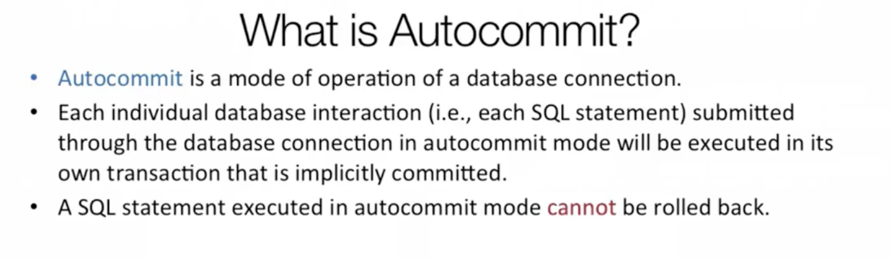

Source: https://www.youtube.com/watch?v=B4kNyGZSH08

### The Problem

You might have a scenario where a customer wants to make a purchase. So minimum of 2 sql statements are necessary to be completed in order to fulfill this order. Together they form 1 transaction.
1. Order completion 
2. Charging payment method

So we can have a situation where the order might not get completed but the payment might have been done. We want to avoid this.

**ACID**
A = Atomic -> Transactions are All or None
C = Consistency -> Only Valid Data is saved
I = Isolation -> Transactions do not affect each other
D = Durability -> Written Data will not be lost

We need to make multiple sql queries as a group, Atomic. 

### Fixes
- Write logic in the businenss layer
- We need to turn off autocommit.

- BeginTransaction()
- Call User DAO (Data Access Layer)
- Call Credential DAO
- Commit() or Rollback()

### Context manager and with statement
